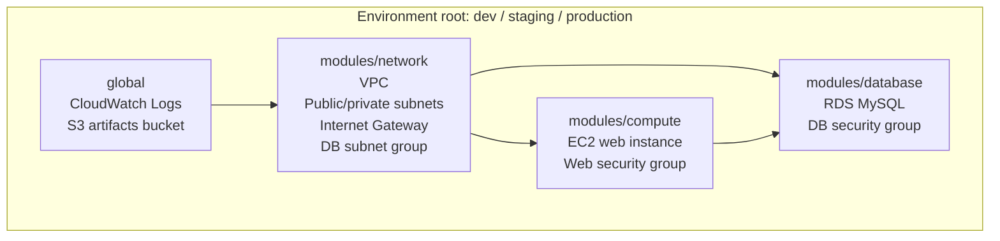

# Terraform AWS Three-Tier Environments

Production-style Terraform example for deploying a small AWS web stack across
`dev`, `staging`, and `production` environments.

> Personal learning project: modular Terraform across dev, staging, and
> production-style environments. It demonstrates infrastructure-as-code
> structure and workflow patterns, but it is not production-tested.

The project is intentionally simple enough for learning, but structured like a
real infrastructure repository: reusable modules, isolated environment roots,
remote state examples, validation tooling, linting, and security scanning.

## Architecture



## What It Creates

- VPC with DNS support and public/private subnets
- Internet Gateway and public route table
- EC2 web instance running Apache
- RDS MySQL instance in private subnets
- Security groups for web and database tiers
- CloudWatch log group
- Encrypted, versioned S3 artifacts bucket with public access blocked

## Repository Layout

```text
.
|-- dev/                    # Development environment root module
|-- staging/                # Staging environment root module
|-- production/             # Production environment root module
|-- global/                 # Shared baseline resources used by each env
|-- modules/
|   |-- network/            # VPC, subnets, routing, DB subnet group
|   |-- compute/            # EC2 instance and web security group
|   `-- database/           # RDS instance and DB security group
|-- docs/
|   `-- modules.md          # Module reference
|-- .github/workflows/      # CI and manual deployment workflows
|-- scripts/
|   `-- plan-all.sh         # Plans all environments
|-- Makefile                # Common local commands
|-- .pre-commit-config.yaml # Terraform fmt/validate/tflint/checkov hooks
`-- .tflint.hcl             # TFLint plugin config
```

## Prerequisites

- Terraform `>= 1.10`
- AWS CLI configured with credentials
- Existing EC2 key pair in the target AWS region
- S3 bucket for Terraform remote state
- S3 state locking enabled with `use_lockfile = true`
- Optional local quality tools:
  - `make`
  - `pre-commit`
  - `tflint`
  - `checkov`
  - `infracost`
  - `terraform-docs`

## Quick Start

The examples below use `dev`. Repeat the same pattern for `staging` and
`production`.

1. Copy the example files:

   ```bash
   cp dev/backend.hcl.example dev/backend.hcl
   cp dev/terraform.tfvars.example dev/terraform.tfvars
   ```

2. Edit the local files:

   ```bash
   $EDITOR dev/backend.hcl
   $EDITOR dev/terraform.tfvars
   ```

3. Initialize Terraform:

   ```bash
   make init-dev
   ```

4. Review the plan:

   ```bash
   make plan-dev
   ```

5. Apply when the plan looks correct:

   ```bash
   terraform -chdir=dev apply
   ```

6. Destroy when you are finished testing:

   ```bash
   terraform -chdir=dev destroy
   ```

## Required Inputs

Each environment needs local values that should not be committed:

```hcl
key_pair_name    = "example-key-pair"
allowed_ssh_cidr = "198.51.100.10/32"
db_password      = "example-change-me-password"
```

You can also override defaults such as the AWS region, VPC CIDR, availability
zones, AMI ID, instance type, database class, and database storage size.

## Common Commands

```bash
make setup           # install pre-commit hooks and initialize tflint
make fmt             # format Terraform files
make fmt-check       # check formatting
make validate        # validate dev, staging, and production
make lint            # run tflint recursively
make security        # run checkov
make docs            # update terraform-docs section in README.md
make plan-dev        # plan dev
make plan-staging    # plan staging
make plan-production # plan production
make cost-dev        # run infracost for dev
```

## Terraform Docs

Run `make docs` to refresh the generated root-module documentation.

<!-- BEGIN_TF_DOCS -->

Generated Terraform inputs and outputs are inserted here by `terraform-docs`.

<!-- END_TF_DOCS -->

## Cost Notes

Defaults are kept small for learning:

- EC2: `t3.micro`
- RDS: `db.t3.micro`
- RDS storage: `20 GB`

AWS Free Tier is account-wide, not per environment. Running `dev`, `staging`,
and `production` at the same time can still create billable usage. For learning,
apply one environment at a time and destroy it when finished.

## CI/CD

The repository includes two GitHub Actions workflows:

1. `.github/workflows/terraform-ci.yml`
   - `terraform fmt -check -recursive`
   - `terraform init -backend=false` and `terraform validate` per environment
   - `tflint --recursive`
   - `checkov -d . --framework terraform`

2. `.github/workflows/terraform-deploy.yml`
   - Runs manually with `workflow_dispatch`
   - Uses GitHub Environments named `dev`, `staging`, and `production`
   - Requires manual approval for `production`
   - Authenticates to AWS with OIDC instead of long-lived AWS keys
   - Runs `terraform plan` by default and only applies when `apply` is selected

For deployment, define these GitHub Environment values:

- `AWS_ROLE_TO_ASSUME` - IAM role ARN trusted by GitHub OIDC
- `AWS_REGION` - target AWS region
- `TF_BACKEND_CONFIG` - backend config matching `backend.hcl.example`
- `TF_VARS` - secret containing environment-specific Terraform variable values

Avoid automatic `apply` from pull requests, especially from forks.

## Production Defaults

Production uses safer database defaults than lower environments:

- RDS deletion protection is enabled.
- Final snapshots are enabled for intentional destroys.
- Backup retention defaults to 14 days.
- CloudWatch log retention defaults to 365 days.
- Multi-AZ is configurable with `db_multi_az`.

## Improvement Ideas

- Customize the AMI lookup filters if your organization uses golden images.
- Add an Infracost pull request comment for cost visibility.
- Split production settings further from lower environments with stricter SSH
  access or AWS Systems Manager Session Manager.
- Add HTTPS with an Application Load Balancer and ACM certificate instead of
  exposing a single EC2 instance directly.
- Add NAT Gateway or VPC endpoints if private workloads need outbound access.
- Add examples or screenshots showing the deployed web page and AWS resource
  layout.
